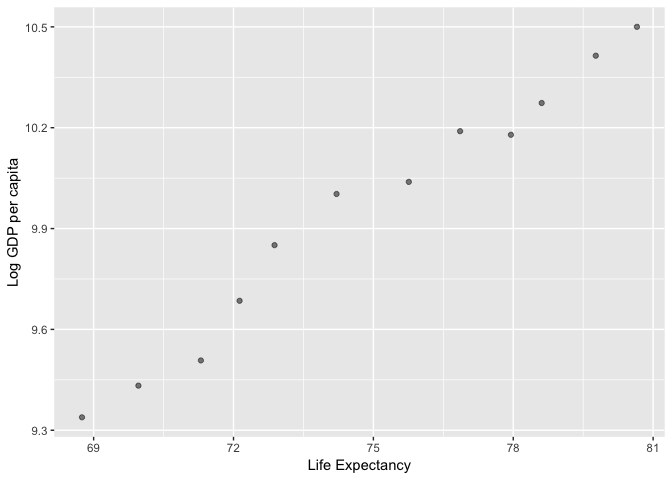
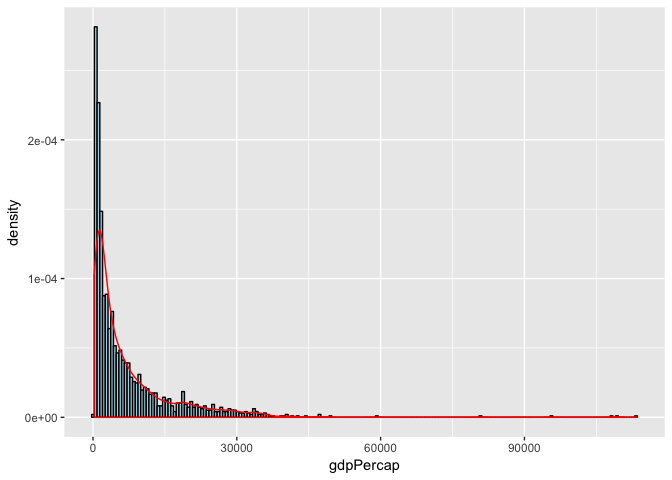
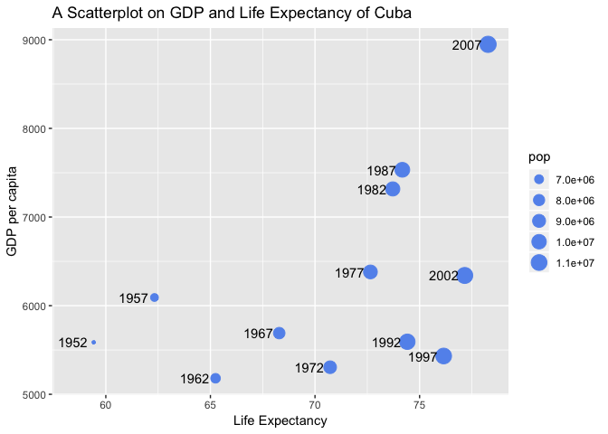
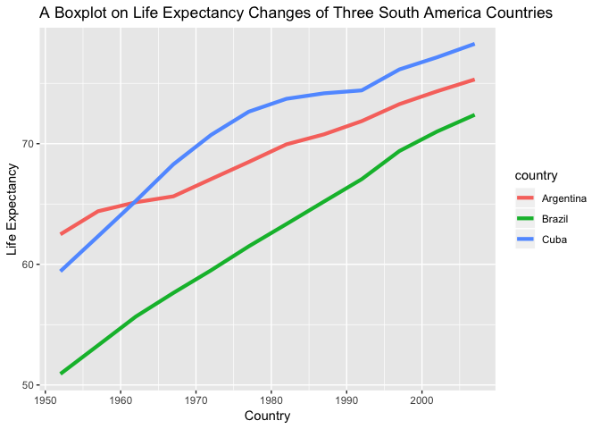

**In this document, ggplot2 and dplyr functionalities are explored.**

Load packages and dataset

```r
suppressPackageStartupMessages(library(ggplot2))
suppressPackageStartupMessages(library(dplyr))
suppressPackageStartupMessages(library(gapminder))
```


# Exercise 1: Basic `dplyr`

### 1.1 Use `filter()` to subset the `gapminder` data to three countries of your choice in the 1970’s.


```r
(gapminder_subset <- gapminder %>% 
  filter(year < 1979 & year > 1970, 
         country=='Afghanistan' | country== 'Albania' | country == 'Algeria'))
```

```
## # A tibble: 6 x 6
##   country     continent  year lifeExp      pop gdpPercap
##   <fct>       <fct>     <int>   <dbl>    <int>     <dbl>
## 1 Afghanistan Asia       1972    36.1 13079460      740.
## 2 Afghanistan Asia       1977    38.4 14880372      786.
## 3 Albania     Europe     1972    67.7  2263554     3313.
## 4 Albania     Europe     1977    68.9  2509048     3533.
## 5 Algeria     Africa     1972    54.5 14760787     4183.
## 6 Algeria     Africa     1977    58.0 17152804     4910.
```

### 1.2 Use the pipe operator `%>%` to select “country” and “gdpPercap” from your filtered dataset in 1.1.


```r
gapminder_subset %>% 
  select(country, gdpPercap)
```

```
## # A tibble: 6 x 2
##   country     gdpPercap
##   <fct>           <dbl>
## 1 Afghanistan      740.
## 2 Afghanistan      786.
## 3 Albania         3313.
## 4 Albania         3533.
## 5 Algeria         4183.
## 6 Algeria         4910.
```

### 1.3 Filter gapminder to all entries that have experienced a drop in life expectancy. Be sure to include a new variable that’s the increase in life expectancy in your tibble. Hint: you might find the `lag()` or `diff()` functions useful.


```r
gapminder %>%
  mutate(lifeExp_gain = c(diff(gapminder$lifeExp), NA)) %>% 
  filter(lifeExp_gain < 0)
```

```
## # A tibble: 221 x 7
##    country   continent  year lifeExp      pop gdpPercap lifeExp_gain
##    <fct>     <fct>     <int>   <dbl>    <int>     <dbl>        <dbl>
##  1 Albania   Europe     1987    72    3075321     3739.       -0.419
##  2 Albania   Europe     2007    76.4  3600523     5937.      -33.3  
##  3 Algeria   Africa     2007    72.3 33333216     6223.      -42.3  
##  4 Angola    Africa     1982    39.9  7016384     2757.       -0.036
##  5 Argentina Americas   2007    75.3 40301927    12779.       -6.20 
##  6 Australia Oceania    2007    81.2 20434176    34435.      -14.4  
##  7 Austria   Europe     2007    79.8  8199783    36126.      -28.9  
##  8 Bahrain   Asia       2007    75.6   708573    29796.      -38.2  
##  9 Belgium   Europe     2007    79.4 10392226    33693.      -41.2  
## 10 Benin     Africa     1997    54.8  6066080     1233.       -0.371
## # … with 211 more rows
```

### 1.4 Filter gapminder so that it shows the max GDP per capita experienced by each country.


```r
gapminder %>% 
  group_by(country) %>% 
  summarize(maxGDP = max(gdpPercap))
```

```
## # A tibble: 142 x 2
##    country     maxGDP
##    <fct>        <dbl>
##  1 Afghanistan   978.
##  2 Albania      5937.
##  3 Algeria      6223.
##  4 Angola       5523.
##  5 Argentina   12779.
##  6 Australia   34435.
##  7 Austria     36126.
##  8 Bahrain     29796.
##  9 Bangladesh   1391.
## 10 Belgium     33693.
## # … with 132 more rows
```

### 1.5 Produce a scatterplot of Canada’s life expectancy vs. GDP per capita using `ggplot2`, without defining a new variable. That is, after filtering the `gapminder` data set, pipe it directly into the `ggplot()` function. Ensure GDP per capita is on a log scale.


```r
gapminder %>%
  filter(country == 'Canada') %>% 
  select(lifeExp, gdpPercap) %>% 
  ggplot(aes(x = lifeExp, y = log(gdpPercap))) +
    geom_point(alpha = 0.5) +
      labs(y="Log GDP per capita", x="Life Expectancy")
```

<!-- -->


# Exercise 2: Explore individual variables with `dplyr`

Pick one categorical variable (`continent`) and one quantitative variable (`gdpPercap`) to explore. Answer the following questions in whichever way you think is appropriate, using `dplyr`:

### 1. What are possible values (or range, whichever is appropriate) of each variable?


```r
gapminder %>%
  group_by(continent) %>% 
  summarize(num_countries = n_distinct(country))
```

```
## # A tibble: 5 x 2
##   continent num_countries
##   <fct>             <int>
## 1 Africa               52
## 2 Americas             25
## 3 Asia                 33
## 4 Europe               30
## 5 Oceania               2
```
For the categorical variable `continent`, there are five values, namely 'Africa', 'Americas', 'Asia', 'Europe', and 'Oceania'. Each variable records countries that are geographically belong to that continent. The above table shows the number of countries that are sampled from each continent.


```r
gapminder %>%
  group_by(continent) %>% 
  summarize(gdp_min = min(gdpPercap), gdp_max = max(gdpPercap))
```

```
## # A tibble: 5 x 3
##   continent gdp_min gdp_max
##   <fct>       <dbl>   <dbl>
## 1 Africa       241.  21951.
## 2 Americas    1202.  42952.
## 3 Asia         331  113523.
## 4 Europe       974.  49357.
## 5 Oceania    10040.  34435.
```
The ranges of quantitative variable `gdpPercap` for each continent are showed in the above table.


### 2. What values are typical? What’s the spread? What’s the distribution? Etc., tailored to the variable at hand.

There are 52 countries in Africa, making Africa the most frequent occurring continent in `gapminder`. Now, in terms of `pop` variable: 


```r
gapminder %>%
  ggplot(aes(x=gdpPercap)) +
  geom_histogram(aes(y=..density..), col='black', fill='lightblue', bins=200) +
  geom_density(alpha=0.5, col='red')
```

<!-- -->
This is a right skewed distribution, indicating that for most countries in most of the time, GDP per capita was relatively low. The probability density function graph demonstrates a wide spread of data, where a few countries in some period of time had extremely high GDP per capita compared to others.


# Exercise 3: Explore various plot types

Make two plots that have some value to them. 


```r
gapminder %>%
  filter(country=='Cuba') %>% 
  ggplot(aes(x=lifeExp, y=gdpPercap)) +
    geom_point(aes(size=pop), col='cornflowerblue') +
      geom_text(aes(label=year), nudge_x = -1) +
        labs(title="A Scatterplot on GDP and Life Expectancy of Cuba ", 
             x="Life Expectancy", y="GDP per capita")
```

<!-- -->

```r
gapminder %>% 
  filter(country=='Cuba' | country=='Argentina' | country=='Brazil') %>% 
  ggplot(aes(x=year, y=lifeExp, col=country)) +
    geom_line(size=1.5) +
      labs(title='A Boxplot on Life Expectancy Changes of Three South America Countries', 
           x='Country', y='Life Expectancy')
```

<!-- -->


# Recycling

Evaluate this code and describe the result. Presumably the analyst’s intent was to get the data for Rwanda and Afghanistan. Did they succeed? Why or why not? If not, what is the correct way to do this?


```r
filter(gapminder, country == c("Rwanda", "Afghanistan"))
```

```
## # A tibble: 12 x 6
##    country     continent  year lifeExp      pop gdpPercap
##    <fct>       <fct>     <int>   <dbl>    <int>     <dbl>
##  1 Afghanistan Asia       1957    30.3  9240934      821.
##  2 Afghanistan Asia       1967    34.0 11537966      836.
##  3 Afghanistan Asia       1977    38.4 14880372      786.
##  4 Afghanistan Asia       1987    40.8 13867957      852.
##  5 Afghanistan Asia       1997    41.8 22227415      635.
##  6 Afghanistan Asia       2007    43.8 31889923      975.
##  7 Rwanda      Africa     1952    40    2534927      493.
##  8 Rwanda      Africa     1962    43    3051242      597.
##  9 Rwanda      Africa     1972    44.6  3992121      591.
## 10 Rwanda      Africa     1982    46.2  5507565      882.
## 11 Rwanda      Africa     1992    23.6  7290203      737.
## 12 Rwanda      Africa     2002    43.4  7852401      786.
```

They did NOT succeed in subsetting. The above code only managed to select half of the dataset that are supposed to be selected. The correct way to achieve the objective is as followed. 


```r
filter(gapminder, country=='Rwanda' | country=='Afghanistan')
```

```
## # A tibble: 24 x 6
##    country     continent  year lifeExp      pop gdpPercap
##    <fct>       <fct>     <int>   <dbl>    <int>     <dbl>
##  1 Afghanistan Asia       1952    28.8  8425333      779.
##  2 Afghanistan Asia       1957    30.3  9240934      821.
##  3 Afghanistan Asia       1962    32.0 10267083      853.
##  4 Afghanistan Asia       1967    34.0 11537966      836.
##  5 Afghanistan Asia       1972    36.1 13079460      740.
##  6 Afghanistan Asia       1977    38.4 14880372      786.
##  7 Afghanistan Asia       1982    39.9 12881816      978.
##  8 Afghanistan Asia       1987    40.8 13867957      852.
##  9 Afghanistan Asia       1992    41.7 16317921      649.
## 10 Afghanistan Asia       1997    41.8 22227415      635.
## # … with 14 more rows
```


# Tibble display

Present numerical tables in a more attractive form using knitr::kable() for small tibbles (say, up to 10 rows), and DT::datatable() for larger tibbles.


```r
gapminder %>%
  filter(country=="Afghanistan" & year %in% 1950:1980) %>% 
  knitr::kable()
```


country       continent    year   lifeExp        pop   gdpPercap
------------  ----------  -----  --------  ---------  ----------
Afghanistan   Asia         1952    28.801    8425333    779.4453
Afghanistan   Asia         1957    30.332    9240934    820.8530
Afghanistan   Asia         1962    31.997   10267083    853.1007
Afghanistan   Asia         1967    34.020   11537966    836.1971
Afghanistan   Asia         1972    36.088   13079460    739.9811
Afghanistan   Asia         1977    38.438   14880372    786.1134


```r
gapminder %>%
  filter(year==1952) %>% 
  DT::datatable()
```

<!--html_preserve--><div id="htmlwidget-792d71810af34b12afad" style="width:100%;height:auto;" class="datatables html-widget"></div>
<script type="application/json" data-for="htmlwidget-792d71810af34b12afad">{"x":{"filter":"none","data":[["1","2","3","4","5","6","7","8","9","10","11","12","13","14","15","16","17","18","19","20","21","22","23","24","25","26","27","28","29","30","31","32","33","34","35","36","37","38","39","40","41","42","43","44","45","46","47","48","49","50","51","52","53","54","55","56","57","58","59","60","61","62","63","64","65","66","67","68","69","70","71","72","73","74","75","76","77","78","79","80","81","82","83","84","85","86","87","88","89","90","91","92","93","94","95","96","97","98","99","100","101","102","103","104","105","106","107","108","109","110","111","112","113","114","115","116","117","118","119","120","121","122","123","124","125","126","127","128","129","130","131","132","133","134","135","136","137","138","139","140","141","142"],["Afghanistan","Albania","Algeria","Angola","Argentina","Australia","Austria","Bahrain","Bangladesh","Belgium","Benin","Bolivia","Bosnia and Herzegovina","Botswana","Brazil","Bulgaria","Burkina Faso","Burundi","Cambodia","Cameroon","Canada","Central African Republic","Chad","Chile","China","Colombia","Comoros","Congo, Dem. Rep.","Congo, Rep.","Costa Rica","Cote d'Ivoire","Croatia","Cuba","Czech Republic","Denmark","Djibouti","Dominican Republic","Ecuador","Egypt","El Salvador","Equatorial Guinea","Eritrea","Ethiopia","Finland","France","Gabon","Gambia","Germany","Ghana","Greece","Guatemala","Guinea","Guinea-Bissau","Haiti","Honduras","Hong Kong, China","Hungary","Iceland","India","Indonesia","Iran","Iraq","Ireland","Israel","Italy","Jamaica","Japan","Jordan","Kenya","Korea, Dem. Rep.","Korea, Rep.","Kuwait","Lebanon","Lesotho","Liberia","Libya","Madagascar","Malawi","Malaysia","Mali","Mauritania","Mauritius","Mexico","Mongolia","Montenegro","Morocco","Mozambique","Myanmar","Namibia","Nepal","Netherlands","New Zealand","Nicaragua","Niger","Nigeria","Norway","Oman","Pakistan","Panama","Paraguay","Peru","Philippines","Poland","Portugal","Puerto Rico","Reunion","Romania","Rwanda","Sao Tome and Principe","Saudi Arabia","Senegal","Serbia","Sierra Leone","Singapore","Slovak Republic","Slovenia","Somalia","South Africa","Spain","Sri Lanka","Sudan","Swaziland","Sweden","Switzerland","Syria","Taiwan","Tanzania","Thailand","Togo","Trinidad and Tobago","Tunisia","Turkey","Uganda","United Kingdom","United States","Uruguay","Venezuela","Vietnam","West Bank and Gaza","Yemen, Rep.","Zambia","Zimbabwe"],["Asia","Europe","Africa","Africa","Americas","Oceania","Europe","Asia","Asia","Europe","Africa","Americas","Europe","Africa","Americas","Europe","Africa","Africa","Asia","Africa","Americas","Africa","Africa","Americas","Asia","Americas","Africa","Africa","Africa","Americas","Africa","Europe","Americas","Europe","Europe","Africa","Americas","Americas","Africa","Americas","Africa","Africa","Africa","Europe","Europe","Africa","Africa","Europe","Africa","Europe","Americas","Africa","Africa","Americas","Americas","Asia","Europe","Europe","Asia","Asia","Asia","Asia","Europe","Asia","Europe","Americas","Asia","Asia","Africa","Asia","Asia","Asia","Asia","Africa","Africa","Africa","Africa","Africa","Asia","Africa","Africa","Africa","Americas","Asia","Europe","Africa","Africa","Asia","Africa","Asia","Europe","Oceania","Americas","Africa","Africa","Europe","Asia","Asia","Americas","Americas","Americas","Asia","Europe","Europe","Americas","Africa","Europe","Africa","Africa","Asia","Africa","Europe","Africa","Asia","Europe","Europe","Africa","Africa","Europe","Asia","Africa","Africa","Europe","Europe","Asia","Asia","Africa","Asia","Africa","Americas","Africa","Europe","Africa","Europe","Americas","Americas","Americas","Asia","Asia","Asia","Africa","Africa"],[1952,1952,1952,1952,1952,1952,1952,1952,1952,1952,1952,1952,1952,1952,1952,1952,1952,1952,1952,1952,1952,1952,1952,1952,1952,1952,1952,1952,1952,1952,1952,1952,1952,1952,1952,1952,1952,1952,1952,1952,1952,1952,1952,1952,1952,1952,1952,1952,1952,1952,1952,1952,1952,1952,1952,1952,1952,1952,1952,1952,1952,1952,1952,1952,1952,1952,1952,1952,1952,1952,1952,1952,1952,1952,1952,1952,1952,1952,1952,1952,1952,1952,1952,1952,1952,1952,1952,1952,1952,1952,1952,1952,1952,1952,1952,1952,1952,1952,1952,1952,1952,1952,1952,1952,1952,1952,1952,1952,1952,1952,1952,1952,1952,1952,1952,1952,1952,1952,1952,1952,1952,1952,1952,1952,1952,1952,1952,1952,1952,1952,1952,1952,1952,1952,1952,1952,1952,1952,1952,1952,1952,1952],[28.801,55.23,43.077,30.015,62.485,69.12,66.8,50.939,37.484,68,38.223,40.414,53.82,47.622,50.917,59.6,31.975,39.031,39.417,38.523,68.75,35.463,38.092,54.745,44,50.643,40.715,39.143,42.111,57.206,40.477,61.21,59.421,66.87,70.78,34.812,45.928,48.357,41.893,45.262,34.482,35.928,34.078,66.55,67.41,37.003,30,67.5,43.149,65.86,42.023,33.609,32.5,37.579,41.912,60.96,64.03,72.49,37.373,37.468,44.869,45.32,66.91,65.39,65.94,58.53,63.03,43.158,42.27,50.056,47.453,55.565,55.928,42.138,38.48,42.723,36.681,36.256,48.463,33.685,40.543,50.986,50.789,42.244,59.164,42.873,31.286,36.319,41.725,36.157,72.13,69.39,42.314,37.444,36.324,72.67,37.578,43.436,55.191,62.649,43.902,47.752,61.31,59.82,64.28,52.724,61.05,40,46.471,39.875,37.278,57.996,30.331,60.396,64.36,65.57,32.978,45.009,64.94,57.593,38.635,41.407,71.86,69.62,45.883,58.5,41.215,50.848,38.596,59.1,44.6,43.585,39.978,69.18,68.44,66.071,55.088,40.412,43.16,32.548,42.038,48.451],[8425333,1282697,9279525,4232095,17876956,8691212,6927772,120447,46886859,8730405,1738315,2883315,2791000,442308,56602560,7274900,4469979,2445618,4693836,5009067,14785584,1291695,2682462,6377619,556263527,12350771,153936,14100005,854885,926317,2977019,3882229,6007797,9125183,4334000,63149,2491346,3548753,22223309,2042865,216964,1438760,20860941,4090500,42459667,420702,284320,69145952,5581001,7733250,3146381,2664249,580653,3201488,1517453,2125900,9504000,147962,372000000,82052000,17272000,5441766,2952156,1620914,47666000,1426095,86459025,607914,6464046,8865488,20947571,160000,1439529,748747,863308,1019729,4762912,2917802,6748378,3838168,1022556,516556,30144317,800663,413834,9939217,6446316,20092996,485831,9182536,10381988,1994794,1165790,3379468,33119096,3327728,507833,41346560,940080,1555876,8025700,22438691,25730551,8526050,2227000,257700,16630000,2534927,60011,4005677,2755589,6860147,2143249,1127000,3558137,1489518,2526994,14264935,28549870,7982342,8504667,290243,7124673,4815000,3661549,8550362,8322925,21289402,1219113,662850,3647735,22235677,5824797,50430000,157553000,2252965,5439568,26246839,1030585,4963829,2672000,3080907],[779.4453145,1601.056136,2449.008185,3520.610273,5911.315053,10039.59564,6137.076492,9867.084765,684.2441716,8343.105127,1062.7522,2677.326347,973.5331948,851.2411407,2108.944355,2444.286648,543.2552413,339.2964587,368.4692856,1172.667655,11367.16112,1071.310713,1178.665927,3939.978789,400.448611,2144.115096,1102.990936,780.5423257,2125.621418,2627.009471,1388.594732,3119.23652,5586.53878,6876.14025,9692.385245,2669.529475,1397.717137,3522.110717,1418.822445,3048.3029,375.6431231,328.9405571,362.1462796,6424.519071,7029.809327,4293.476475,485.2306591,7144.114393,911.2989371,3530.690067,2428.237769,510.1964923,299.850319,1840.366939,2194.926204,3054.421209,5263.673816,7267.688428,546.5657493,749.6816546,3035.326002,4129.766056,5210.280328,4086.522128,4931.404155,2898.530881,3216.956347,1546.907807,853.540919,1088.277758,1030.592226,108382.3529,4834.804067,298.8462121,575.5729961,2387.54806,1443.011715,369.1650802,1831.132894,452.3369807,743.1159097,1967.955707,3478.125529,786.5668575,2647.585601,1688.20357,468.5260381,331,2423.780443,545.8657229,8941.571858,10556.57566,3112.363948,761.879376,1077.281856,10095.42172,1828.230307,684.5971438,2480.380334,1952.308701,3758.523437,1272.880995,4029.329699,3068.319867,3081.959785,2718.885295,3144.613186,493.3238752,879.5835855,6459.554823,1450.356983,3581.459448,879.7877358,2315.138227,5074.659104,4215.041741,1135.749842,4725.295531,3834.034742,1083.53203,1615.991129,1148.376626,8527.844662,14734.23275,1643.485354,1206.947913,716.6500721,757.7974177,859.8086567,3023.271928,1468.475631,1969.10098,734.753484,9979.508487,13990.48208,5716.766744,7689.799761,605.0664917,1515.592329,781.7175761,1147.388831,406.8841148]],"container":"<table class=\"display\">\n  <thead>\n    <tr>\n      <th> <\/th>\n      <th>country<\/th>\n      <th>continent<\/th>\n      <th>year<\/th>\n      <th>lifeExp<\/th>\n      <th>pop<\/th>\n      <th>gdpPercap<\/th>\n    <\/tr>\n  <\/thead>\n<\/table>","options":{"columnDefs":[{"className":"dt-right","targets":[3,4,5,6]},{"orderable":false,"targets":0}],"order":[],"autoWidth":false,"orderClasses":false}},"evals":[],"jsHooks":[]}</script><!--/html_preserve-->


