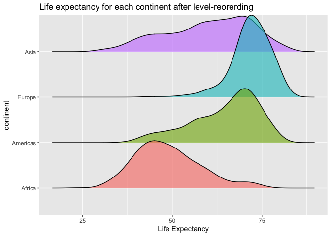
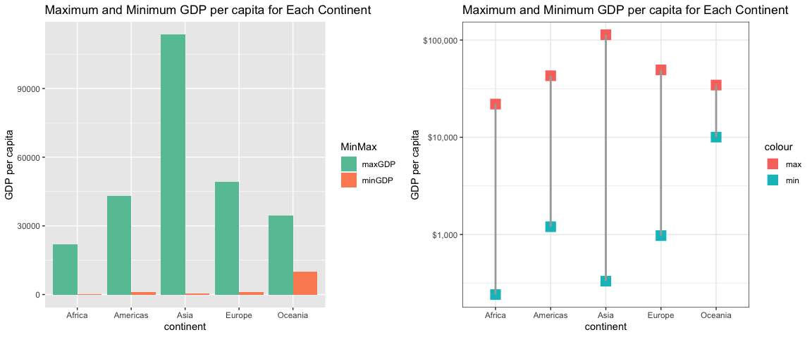

```r
# Load packages
suppressPackageStartupMessages(library(dplyr))
suppressPackageStartupMessages(library(forcats))
suppressPackageStartupMessages(library(ggplot2))
suppressPackageStartupMessages(library(ggridges))
suppressPackageStartupMessages(library(readr))
suppressPackageStartupMessages(library(gridExtra))
suppressPackageStartupMessages(library(tidyr))
```


## Exercise 1: Explain the value of the here::here package
*In your own words, summarize the value of the here::here package in 250 words or fewer.*

`here` gives you the root directory and it works on different opearting systems. Unlike manually typing out relative path or sub-directories of which the rules vary across different OS, the root directory `here` provided will make your code reproducible outside of R projects if your collaborators want to run your code on their machines. In addition, since `here` works with root directory, therefore, any changes made to that file will reflect on it which means even though the relative directory changes along with the file, `here` can still detect the location of this file.

## Exercise 2: Factor management
In this exercise, the dataset `gapmidner` explored.

### 2.1 Drop Oceania

```r
# Load dataset `gapminder`:
library(gapminder)

# Check if the variable `continent` is a factor:
gapminder$continent %>% class()
```

```
## [1] "factor"
```

The variable `continent` is indeed a factor. Next, the dataset is modified to include all the continents except for 'Oceania'. And the unused factors/levels are dropped.


```r
no_oceania <- gapminder %>% 
  filter(continent != "Oceania")

# Check the number of factors/levels for `continent` in the `africa_asia` subset.
nlevels(no_oceania$continent)
```

```
## [1] 5
```

```r
levels(no_oceania$continent)
```

```
## [1] "Africa"   "Americas" "Asia"     "Europe"   "Oceania"
```

```r
# As it turns out, there are still five factors/levels even though only four continents 
# exist in the `no_oceania` subset. The unused factors/levels are therefore dropped.
no_oceania <- droplevels(no_oceania)
nlevels(no_oceania$continent)
```

```
## [1] 4
```

```r
levels(no_oceania$continent)
```

```
## [1] "Africa"   "Americas" "Asia"     "Europe"
```

```r
# Check the number of rows for the original `gapminder` data and the modified `no_oceania`.
gapminder %>% nrow()
```

```
## [1] 1704
```

```r
no_oceania %>% nrow()
```

```
## [1] 1680
```

Now, we only have four factors in `no_oceania` dataset to represent the four continents we have in this subset. `gapminder` has 1704 rows while `no_oceania` has 1680 rows which means 24 entries of Oceania are removed.


### 2.2 Reorder the levels of `continent`

The `forcats` package is used to change the order of factor levels for `continent` based on the maximum of life expectancy. Compare the results of arrange on the original and re-leveled factor.


```r
# Reorder the levels based on the maximum of life expectancy:
reorder <- no_oceania %>% 
  mutate(continent=fct_reorder(continent, lifeExp, max))

# Examine the order of levels before and after the change:
(before <- levels(no_oceania$continent))
```

```
## [1] "Africa"   "Americas" "Asia"     "Europe"
```

```r
(after <- levels(reorder$continent))
```

```
## [1] "Africa"   "Americas" "Europe"   "Asia"
```

Before ordering the levels based on the maximum of life expectancy, the continent levels are ordered alphabetically. We can see now the order has changed from  Africa, Americas, Asia, Europe to Africa, Americas, Europe, Asia. After viewing the differences of these two dataset in a tibble display, instead of `Europe`, `Asia` is now the last continent in the table.


```r
# Before the reordering, Europe appears last on the list:
no_oceania %>% 
  arrange(continent) %>% 
  tail() %>% 
  knitr::kable()
```


country          continent    year   lifeExp        pop   gdpPercap
---------------  ----------  -----  --------  ---------  ----------
United Kingdom   Europe       1982    74.040   56339704    18232.42
United Kingdom   Europe       1987    75.007   56981620    21664.79
United Kingdom   Europe       1992    76.420   57866349    22705.09
United Kingdom   Europe       1997    77.218   58808266    26074.53
United Kingdom   Europe       2002    78.471   59912431    29479.00
United Kingdom   Europe       2007    79.425   60776238    33203.26

```r
# After the reordering, Asia should appear last on the list:
reorder %>% 
  arrange(continent) %>% 
  tail() %>% 
  knitr::kable()
```


country       continent    year   lifeExp        pop   gdpPercap
------------  ----------  -----  --------  ---------  ----------
Yemen, Rep.   Asia         1982    49.113    9657618    1977.557
Yemen, Rep.   Asia         1987    52.922   11219340    1971.742
Yemen, Rep.   Asia         1992    55.599   13367997    1879.497
Yemen, Rep.   Asia         1997    58.020   15826497    2117.485
Yemen, Rep.   Asia         2002    60.308   18701257    2234.821
Yemen, Rep.   Asia         2007    62.698   22211743    2280.770

Now, visualize the effect of level-reordering on the plot.


```r
# Before reordering:
no_oceania %>% 
  ggplot(aes(x=lifeExp, y=continent, fill=continent)) +
  geom_density_ridges(alpha=0.6) +
  labs(title="Life expectancy for each continent before level-reorerding",
       x="Life Expectancy") +
  theme(legend.position="none")
```

<!-- -->

```r
# After reordering: 
reorder %>% 
  ggplot(aes(x=lifeExp, y=continent, fill=continent)) +
  geom_density_ridges(alpha=0.6) +
  labs(title="Life expectancy for each continent after level-reorerding",
       x="Life Expectancy") +
  theme(legend.position="none")
```

<!-- -->

After the reordering, `Asia` is now showing as the first continent on the plot.


## Exercise 3: File input/output

Create a subset of `gapminder` that only includes entries from 1952. Export it to disk and then reload it back in.


```r
year_1952 <- gapminder %>%
  filter(year=='1952')

# Write `year_1952` dataset to `hw05` folder under the current directory:
write_csv(year_1952, here::here("hw05", "1952_dat.csv"))

# Read the dataset in:
(reload <- read_csv(here::here("hw05", "1952_dat.csv")))
```

```
## # A tibble: 142 x 6
##    country     continent  year lifeExp      pop gdpPercap
##    <chr>       <chr>     <dbl>   <dbl>    <dbl>     <dbl>
##  1 Afghanistan Asia       1952    28.8  8425333      779.
##  2 Albania     Europe     1952    55.2  1282697     1601.
##  3 Algeria     Africa     1952    43.1  9279525     2449.
##  4 Angola      Africa     1952    30.0  4232095     3521.
##  5 Argentina   Americas   1952    62.5 17876956     5911.
##  6 Australia   Oceania    1952    69.1  8691212    10040.
##  7 Austria     Europe     1952    66.8  6927772     6137.
##  8 Bahrain     Asia       1952    50.9   120447     9867.
##  9 Bangladesh  Asia       1952    37.5 46886859      684.
## 10 Belgium     Europe     1952    68    8730405     8343.
## # … with 132 more rows
```

As shown above, the output and input were successful. With the imported data, play around with factor levels and use factors to order the data with one of the factors (i.e. non-alphabetically). For this question, `continent` is reordered by the mean of `gdpPercap`.


```r
reload %>% 
  filter(continent != "Oceania") %>% 
  ggplot(aes(x=gdpPercap, y=fct_reorder(continent, gdpPercap, mean), fill=continent)) +
  scale_x_log10() +
  geom_density_ridges(alpha=0.6) +
  labs(title="GDP Per Capita for each continent in the year of 1952",
       x="GDP PerCapita", 
       y="Continent") +
  theme(legend.position="none")
```

```
## Picking joint bandwidth of 0.13
```

<!-- -->


## Exercise 4: Visualization design

Example is taken from hw03:  
Evaluate the maximum and minimum GDP per capita


```r
# A bar plot showing the maximum and minimum of GDP per capita for all continents.
dat <- gapminder %>%
  group_by(continent) %>% 
  summarize(minGDP=min(gdpPercap), maxGDP=max(gdpPercap))

t <- dat %>% 
  gather(MinMax, gdp, c(minGDP, maxGDP))

before_p <- ggplot(t, aes(x=continent, y=gdp, fill=MinMax)) +
   geom_col(position = "dodge") +
   labs(title='Maximum and Minimum GDP per capita for Each Continent',
          y='GDP per capita') +
   scale_fill_brewer(palette="Set2")

after_p <- ggplot(dat) +
  geom_point(aes(x=continent, y=minGDP, color="min"), size=5, shape="square") +
  geom_point(aes(x=continent, y=maxGDP, color="max"), size=5, shape="square") +
  geom_linerange(aes(x=continent, ymin=minGDP, ymax=maxGDP), size=1, color="dark gray") +
  scale_y_log10(labels=scales::dollar_format()) +
  labs(title='Maximum and Minimum GDP per capita for Each Continent',
       y="GDP per capita") +
  theme_bw()
```


```r
grid.arrange(before_p, after_p, ncol=2)
```

<!-- -->

The previous plot I produced does not clearly show the minimum and maximum values. Because GDP per capita has a very large range both within and across continents, some of the bars are nearly invisible on the plot. What is more, to plot a side by side bar plot like this, an extra step of data organization needs to be taken care of by using `gather()` function.  
After the modification, the spread of GDP per capita can be visualized and compared in a straightforward manner. GDP per capita on the y-axis is now on a log10 scale with unit on, which is more logic and accurate.


## Exercise 5: Writing figures to file

In this exercise, `ggsave()` is used to explicitly save a plot to file. Exported plot is included as part of my assignment.


```r
# Save the plot `after_p1` to file by specifying the name of the plot in the `plot=` argument.
ggsave(here::here("hw05", "after_p"), plot=after_p, device="png")
```

```
## Saving 7 x 5 in image
```


